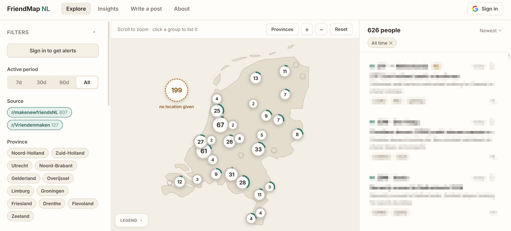
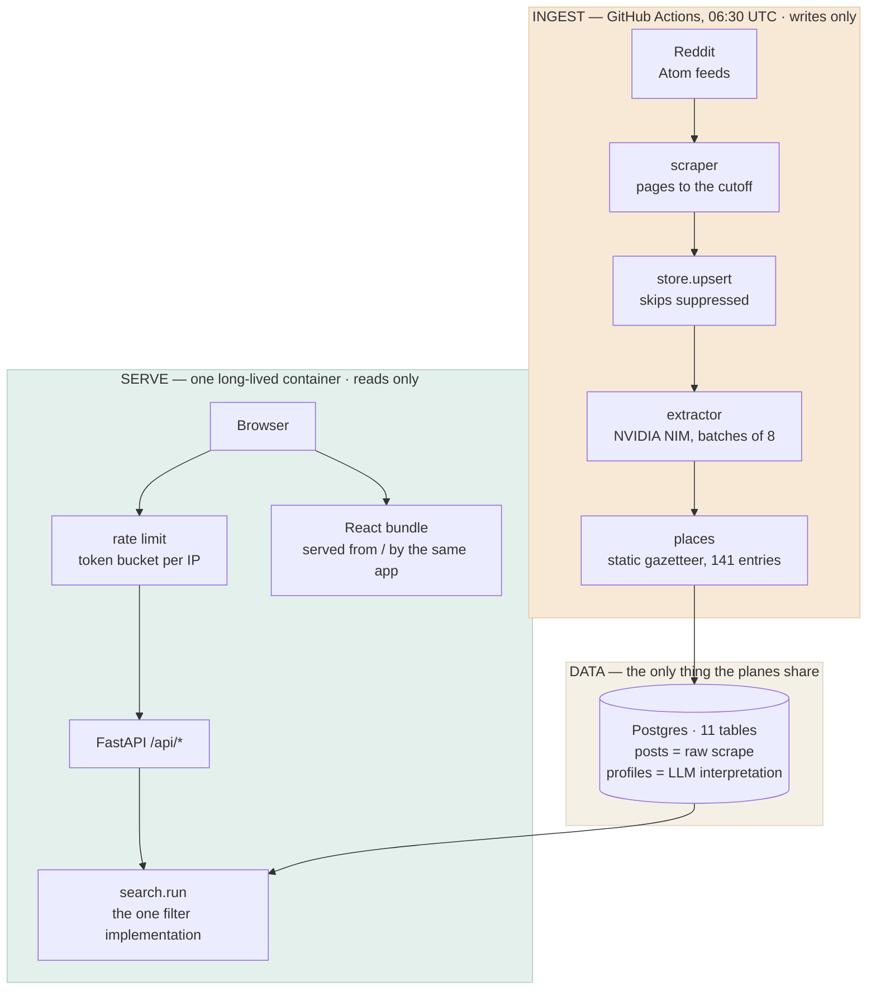

<p align="center">
  
</p>

<h1 align="center">FriendMap NL</h1>

<p align="center">
  A map-first browser over public posts from the Dutch friend-finding subreddits
  (r/makenewfriendsNL and r/Vriendenmaken by default). A daily job scrapes each
  one, an LLM pulls out age / location / interests / a one-line summary, and the
  result is plotted on a map of the Netherlands.
</p>

<p align="center">
  
</p>

<p align="center">
  <sub>The person list is pixelated on purpose — those are real people's posts.
  See <a href="#personal-data">Personal data</a>.</sub>
</p>

It's a browser, not a network: **no messaging**, and nothing is ever sent to
anyone on your behalf. Every card links back to the original Reddit post, which
is where any actual conversation happens. Signing in is optional and adds only
private, personal state — a saved list, notes to yourself, and email alerts for
a search you saved. None of it is visible to anyone else, and none of it changes
what the people on the map see, because they never signed up for any of this.

The icon is two overlapping map pins — two people, one place. It's generated
from a single geometry definition in [docs/make_icon.py](docs/make_icon.py),
which emits the SVG and every PNG size, so they can't drift apart.

## Stack

| Layer  | What                                                        |
| ------ | ----------------------------------------------------------- |
| Ingest | Python — Reddit Atom feeds, NVIDIA NIM (llama-3.3-70b)       |
| DB     | Postgres 16 in Docker                                       |
| API    | FastAPI + SQLAlchemy 2.0                                    |
| Web    | React 18 + TypeScript + Vite, hand-drawn SVG map            |
| Deploy | One Docker image (bundle + API) → GHCR → Render             |

## Running it locally

Three terminals. From `friendsMap/`:

```bash
# 1. database
docker compose up -d

# 2. API  (http://127.0.0.1:8000, docs at /docs)
cd backend
python -m venv .venv
.venv/Scripts/python.exe -m pip install -r requirements.txt   # Windows
cp ../.env.example ../.env    # then fill in NVIDIA_API_KEY
.venv/Scripts/python.exe manage.py init-db
.venv/Scripts/python.exe manage.py serve

# 3. web  (http://localhost:5173)
cd web
npm install
npm run dev
```

Open **http://localhost:5173**.

## CLI

```bash
python manage.py init-db                    # create tables + seed gazetteer
python manage.py backfill ../../friends.json  # load an existing scrape
python manage.py ingest --days 7            # the daily job, every source
python manage.py ingest --sources Vriendenmaken   # or just one
python manage.py regeocode                  # re-resolve locations (no LLM cost)
python manage.py reextract [--limit N]      # re-run the LLM on stored posts
python manage.py serve [--reload]
python manage.py reset --yes                # drop all tables

# Erasure request. Deletes now *and* records it, because the post is still
# live on Reddit and the next scrape would otherwise put it straight back.
# Takes a permalink or a bare id.
python manage.py suppress --post https://reddit.com/r/x/comments/abc123/t/ \
                          --reason "emailed 2026-08-07"
python manage.py suppress --author someone  # them, and any post they make later

python manage.py purge [--days N]           # retention sweep, default RETENTION_DAYS
```

## How it fits together

Three deliberately decoupled planes. **Ingest writes, serve reads, and Postgres
is the only thing they share** — the serving side never calls Reddit or the LLM,
which is why a page load is fast while extraction is slow and rate-limited, and
why the site keeps working when the ingest breaks. It just stops getting fresher.



Four consequences of that shape, each load-bearing:

- **`posts` and `profiles` are separate tables.** Re-running extraction with a
  better prompt costs API calls but never a re-scrape, and `regeocode` fixes a
  missing town without touching the LLM at all.
- **Extraction heals itself.** It selects posts with *no profile yet*, not
  posts inserted today, so a batch that failed to a timeout is retried by the
  next run instead of being invisible forever.
- **There is no `people` table.** People are grouped by author at query time, so
  the grouping can't drift from the posts it summarises. `person_key` is a keyed
  HMAC of the username, which is why saves survive a repost without the username
  ever being served.
- **One origin.** FastAPI serves the API *and* the bundle, so the browser needs
  no CORS and the session cookie no cross-site relaxation.

**[docs/architecture.md](docs/architecture.md)** goes through the whole thing
properly — the three planes and why they're decoupled, the ingest pipeline and
which orderings are load-bearing, the data model, the read path, and a table of
failure modes with how each is handled. Diagrams included.

### The daily job

`backend/scripts/daily_ingest.cmd` is the entry point Task Scheduler calls; it
wraps `manage.py ingest --days 7` and appends everything to
`backend/logs/ingest.log` (rotated past 5 MB). Register it with:

```powershell
Register-ScheduledTask -TaskName FriendMapNL-DailyIngest `
  -Action    (New-ScheduledTaskAction -Execute cmd.exe -Argument '/c "<repo>/backend\scripts\daily_ingest.cmd"') `
  -Trigger   (New-ScheduledTaskTrigger -Daily -At 08:30) `
  -Principal (New-ScheduledTaskPrincipal -UserId $env:USERNAME -LogonType Interactive) `
  -Settings  (New-ScheduledTaskSettingsSet -StartWhenAvailable -MultipleInstances IgnoreNew)
```

Two things that are easy to get wrong:

- **The `.cmd` must have CRLF line endings and no BOM.** With LF, `cmd.exe`
  eats the first character of every line (`setlocal` becomes `etlocal`) and the
  script fails in a way that still exits 0.
- **`LogonType Interactive`, not `S4U`.** Postgres runs in Docker Desktop,
  which only exists inside a logged-on session — a task set to "run whether the
  user is logged on or not" would just fail to reach the database.

`StartWhenAvailable` catches up a run missed while the machine was off, which
matters because the alert digests only fire from inside this job.

### Sources

`SUBREDDITS` in `.env` is a comma-separated list; the scraper walks each one's
Atom feed in turn and tags every post with where it came from (`Post.subreddit`,
already indexed). Adding a third is a config change, not a code change — the
old singular `SUBREDDIT` is still read as a fallback.

Two dedupe layers matter once there's more than one source:

- **By post id**, across sources — a crosspost carries the same id, and the
  source listed first in config wins.
- **By author**, in `query.dedupe_by_author` — people routinely post the same
  appeal to every NL friend subreddit, and they should be one pin, not one per
  subreddit. Their most recent post wins regardless of which source it came
  from.

`/api/meta/sources` reports what's actually in the data rather than what's in
config, so a subreddit that was ingested once and later dropped from `.env`
still labels its own rows. The filter rail's Source section only appears when
there's more than one.

### Sign in with Google

Optional and entirely additive — browsing, filtering and the map work signed
out exactly as before, and nothing is gated behind an account. With
`GOOGLE_CLIENT_ID` / `GOOGLE_CLIENT_SECRET` / `SESSION_SECRET` unset,
`AUTH_ENABLED` is false, every auth route 503s or returns null, and the UI
hides the button.

Setup:

1. Google Cloud console → APIs & Services → Credentials → **Create OAuth
   client ID** → *Web application*.
2. Add `http://localhost:5173/api/auth/google/callback` as an **Authorised
   redirect URI** — it must match `OAUTH_REDIRECT_URL` character for character.
3. Fill the three values in `.env`, generate `SESSION_SECRET` with
   `python -c "import secrets; print(secrets.token_urlsafe(48))"`, restart.

Implementation notes:

- Authorization-code flow written against `requests` — three HTTP calls, no
  OAuth library to audit.
- **No passwords are stored.** The only durable identifier is Google's opaque
  `sub`; email and name are a display cache refreshed on each sign-in, because
  people rename themselves and change addresses.
- The ID token's signature is not re-verified. It arrives in the body of our
  own server-to-server HTTPS call to Google's token endpoint, which is the
  case Google documents as not requiring verification. A client-supplied token
  is never accepted anywhere.
- `state` is generated per sign-in and checked with `compare_digest`; the
  session is cleared and reissued after login to prevent session fixation.
- Session is a signed cookie (`itsdangerous`), `SameSite=Lax` so it survives
  Google's top-level redirect back, `Secure` automatically when `WEB_ORIGIN`
  is https.
- In dev the browser talks to Vite on :5173 and Vite proxies `/api`, so
  everything is same-origin and the cookie needs no cross-site relaxation.

### Writing a post (the composer)

`/api/meta/writing-tips` reports what the corpus is *missing* — share of posts
with no usable location, no identifiable interests, no stated age, plus the
median body length. The composer's checklist renders those numbers directly,
so every claim it makes is computed from the live board with the sample size
shown.

It deliberately does **not** claim which posts get replies. Reddit's Atom feed
carries no comment count and nothing stores one, so that advice would be
invention. Getting it would mean fetching each post's own comments feed —
roughly 900 extra requests — and is specced but unbuilt (SPECS.md, Spec 5a).

The app never posts on anyone's behalf: it produces text and a link to the
subreddit's own submit page.

### Locations

A static gazetteer (~135 NL places plus aliases like `NH`, `Den Bosch`,
`South-Holland`) resolves free text to a city or province. Anything unresolvable
stays unplaced and shows in the "didn't share a location" tray rather than being
guessed at.

### Reading a crowded map

535 people land on 67 distinct coordinates — everyone in a city gets that city's
exact pair, so the dots don't merely overlap, they coincide. `web/src/cluster.ts`
re-clusters them in screen space on every zoom change: sites first (exact
duplicates), then a greedy merge of sites within 26px. Markers are counts;
scroll or double-click to break a cluster apart; click one to list its members
in the side panel, which is the only way in for groups too big to fan out.
Clusters of 20 or fewer spiderfy on selection so each person is separately
clickable on the map.

The 158 people who never named a place arrive carrying Amsterdam's coordinates.
Left there they outnumbered the 55 real Amsterdammers on one pixel, so the map
relocates them to a dashed offshore marker labelled "no location given". The
API still sends the Amsterdam fallback — the move is presentational.

Coordinates are projected server-side into the design's 460×552 SVG viewBox.
The artwork turned out to be plain Web Mercator, so `ingest/projection.py`
reproduces the designer's own pixel table to within 0.05px.

### Privacy posture

These posts are already public on Reddit. What this app adds is *aggregation*,
so that's what the safeguards target.

- City-level precision at most; province-only posts render as a soft blur.
- **No usernames leave the backend.** Reddit's Atom feed ends every body with
  `submitted by / u/handle / [link] / [comments]`; that's stripped at ingest
  and again on read (`ingest/textclean.py`), and `PersonOut.author` is
  `Field(exclude=True)` — kept in-process for dedupe and repeat counts, never
  serialised. Anyone who wants the handle can follow the permalink.
- **Nothing here is indexable.** `X-Robots-Tag: noindex, nofollow, noarchive`
  on every API response, a matching `<meta name="robots">` in the web app, and
  `Disallow: /` from both origins. A searchable index of 500-odd people's posts
  under one roof is the real harm; this is the cheapest way to prevent it.
- **`/api/*` is rate limited** per client IP (`RATE_LIMIT_RPM`, default 120,
  burst 60). Note what this does and doesn't do: `/api/profiles` returns the
  whole board in one response because the map needs every pin, so one request
  still gets everything. The limit stops *repeated* polling, which is what
  tracking the board over time would require.
- `ingest` re-checks stored permalinks and marks 404s deleted, so removing a
  post on Reddit removes it here within a day.
- No accounts and no contact features of any kind — outbound links only.
  Deliberate: storing emails and passwords would make this a data controller
  over a dataset it doesn't need, and would protect nobody on the map.

The rate limiter is in-process, so it resets on restart and doesn't span
workers. Behind a reverse proxy or multiple workers, enforce it there instead.

## Personal data

Most of the personal data here belongs to people who never submitted it and do
not know this exists. That's the central fact about this app, so the handling is
part of the design rather than a policy bolted on afterwards.

**In the code:**

- The Reddit **username is never served** — excluded from the response model, not
  merely left out by habit. The per-person id is a keyed HMAC, so it can't be
  reversed with a username wordlist.
- **No special-category data is inferred.** The interest vocabulary deliberately
  omits health, mental health, sexuality, religion, ethnicity and politics, all
  of which appear in the posts. Loneliness and mental health were *measured* at
  9.2% of posts and still left out; see `INTEREST_VOCAB` in `app/models.py`.
- **Nothing is indexable**: `noindex, nofollow, noarchive` as a meta tag and a
  response header, plus a `robots.txt` disallow. One public post is one public
  post; several hundred sorted by age, city and interest is a different artefact.
- **No third-party requests at all.** Inter is self-hosted; no analytics, no
  pixels, no font CDN. Nothing reaches out on a visitor's behalf, which is also
  why there's no consent banner. Google Fonts used to be loaded from Google,
  which sent every visitor's IP to a third party before the page had asked
  anyone anything.
- **Erasure is durable.** `manage.py suppress` deletes *and* records the request
  in `suppressions`, which `upsert_posts` honours — so tomorrow's scrape can't
  undo it. Deleting the row alone only works until 06:30.
- **Retention is enforced, not implied.** `RETENTION_DAYS` (default 180) deletes
  old posts outright in the daily job. Hiding after 30 days is not erasing.
- **Signed-in users** can export everything (`/api/me/export`) and delete their
  account, which cascades.

**Set before this is publicly reachable:** `CONTROLLER_NAME` and
`PRIVACY_CONTACT`. Without them `/privacy` states that the deployment has no
controller — the honest failure mode, but not one to ship.

**Documents:** the notice is served at `/privacy`, server-rendered so it works as
a direct link for the Google OAuth consent screen. The Art. 6(1)(f) balancing
test is
[docs/legitimate-interest-assessment.md](docs/legitimate-interest-assessment.md),
including what's still unresolved — how minors are treated, and the reliance on
Art. 14(5)(b) for individual notice.

**Still outstanding:** no data-processing agreement with NVIDIA or Resend, which
receive post text and email addresses respectively.

### If you run this yourself, you are the controller

Not the author of this repository. The moment you point it at a database and
give it an API key, **you** decide the purposes and means of the processing,
which is what Art. 4(7) GDPR defines a controller as. Cloning the code
transfers that to you along with it.

That is not a formality. This app collects and structures personal data about
people who never submitted it and do not know it exists — several hundred of
them within a week of running. Before you expose it to anyone but yourself:

1. **Set `CONTROLLER_NAME` and `PRIVACY_CONTACT`.** `/privacy` refuses to name a
   controller until you do — it says the deployment is unconfigured instead of
   inventing one. That is a deliberate blocker, not a bug. The contact has to be
   an address you actually read: Art. 12(3) gives you one month to answer.
2. **Read [the LIA](docs/legitimate-interest-assessment.md)** and decide whether
   you agree with it. It lists the tripwires that would make the processing
   indefensible — making the site indexable, adding any way to contact a person
   from inside the app, extending the vocabulary to health or sexuality,
   publishing usernames. Those are load-bearing, not stylistic.
3. **Decide what you do about minors.** Age is extracted and some posters are
   under 18. This code treats them like anyone else, by omission rather than by
   decision. Yours to make deliberately.
4. **Know the removal command before you need it**, not after:
   `manage.py suppress --post <url> --reason "..."`. It works because the
   suppression survives the next scrape; deleting a row does not.
5. **Sign DPAs** with whichever inference and mail providers you use. Post text
   goes to the LLM provider; email addresses go to the mail provider.

Running it **privately** — on your own machine, not published, for your own use
— is a materially different position, with a reasonable claim to the household
exemption in Art. 2(2)(c). Publishing it to anyone else is not, and that is
where the list above starts applying.

The distributed image contains code and an empty schema. It ships no personal
data, and neither does this repository: the sample entries in
`FriendMap NL (standalone).html` are fabricated design data — verified by
checking every title and body fragment against a real 934-post corpus with zero
matches, and their permalinks are placeholders.

## Deploying to Render

One container, one origin. The web app calls the API on relative `/api` paths
and the session cookie is `SameSite=Lax`, so hosting the bundle separately
would mean CORS *and* a cross-site cookie. Instead the image builds the React
app and FastAPI serves `dist/` — production keeps the same shape as dev, where
Vite's proxy already made everything same-origin.

```
push to main ──► GitHub Actions ──► ghcr.io/yusuprozimemet/friendmap:latest
                  (build + smoke)              │
                                    Render pulls the image ──► web service
                                               │                    │
                     GitHub Actions (06:30 UTC) └──► Render Postgres ┘
                     runs the same image: `ingest --days 7`
```

Render never sees this source tree — it pulls what CI published, which is the
same artefact the smoke test ran against.

### Try the real image first

```bash
docker compose --profile app up --build     # http://localhost:8000
```

That's the production path end to end: multi-stage build, bundle served by
FastAPI, `init-db` on boot. It catches what dev mode hides — a missing
dependency, a type error, the static mount — without waiting on CI.

### One-time setup

1. **Publish the image.** Push to `main`; CI builds and pushes to GHCR. A
   package published by Actions inherits the repository's visibility, so from
   a public repo it lands public and Render can pull it anonymously. Check it
   once (GitHub → your profile → Packages → `friendmap`); if it says Private,
   either change the visibility there or add a registry credential in the
   Render dashboard, otherwise the pull 403s.

2. **Generate the two secrets**, once, and keep them somewhere durable:

   ```bash
   python -c "import secrets; print(secrets.token_urlsafe(48))"   # x2
   ```

   `SESSION_SECRET` signs the session cookie *and* the unsubscribe links in
   alert emails, so the web service and the ingest job must carry the same
   value — a mismatch makes every link in every digest invalid.
   `PERSON_KEY_SECRET` is durable: saved people and notes key off it, and
   rotating it orphans every saved row.

3. **Create the two services** in the Render dashboard. There is no
   `render.yaml` blueprint — the service is configured once by hand, because
   the image is the only artefact Render consumes and a blueprint that has to
   be kept in step with the dashboard is a second source of truth for nothing.

   **Postgres**: New → Postgres, version 16, free plan, region `frankfurt`.
   Under Access Control add `0.0.0.0/0` — the GitHub Actions ingest job needs
   to reach it and Render publishes no static egress range for runners, so the
   credentials are the actual control. On a paid plan, use a Render cron job
   instead and close external access entirely.

   **Web service**: New → Web Service → *Existing image*
   `ghcr.io/yusuprozimemet/friendmap:latest`, free plan, same region, health
   check path `/healthz`. Then set the environment:

   | Variable | Value | Why |
   | --- | --- | --- |
   | `DATABASE_URL` | the Postgres **Internal** URL | the image rewrites `postgres://` to psycopg 3 itself |
   | `TRUST_PROXY` | `true` | see below — without it the whole internet shares one bucket |
   | `WEB_CONCURRENCY` | `1` | the rate limiter's buckets are in-process |
   | `RATE_LIMIT_RPM` | `120` | free instances sleep; a cold page load bursts |
   | `RATE_LIMIT_BURST` | `60` | |
   | `WEB_ORIGIN` | `https://<host>` | flips the session cookie to `Secure`; alert emails link here |
   | `OAUTH_REDIRECT_URL` | `https://<host>/api/auth/google/callback` | must match the Google console verbatim |
   | `SESSION_SECRET` | generated above | same value as the ingest job's |
   | `PERSON_KEY_SECRET` | generated above | durable — rotating orphans every saved row |
   | `GOOGLE_CLIENT_ID` | from the Google console | leave both blank to run anonymously |
   | `GOOGLE_CLIENT_SECRET` | from the Google console | |
   | `NVIDIA_API_KEY` | your NIM key | the API never calls the LLM; present so a one-off `render exec` ingest works |
   | `SUBREDDITS` | `makenewfriendsNL,Vriendenmaken` | |
   | `MAIL_BACKEND` | `console`, `smtp` or `resend` | `console` sends nothing — the safe default |
   | `MAIL_FROM` | `FriendMap NL <alerts@…>` | |

4. **Fix the hostname.** Once Render assigns one, set `WEB_ORIGIN` and
   `OAUTH_REDIRECT_URL` to it, and add that redirect URI to the Google console
   verbatim. `WEB_ORIGIN` starting `https://` is what flips the session cookie
   to `Secure`.

5. **Auto-deploy (optional).** Render → service → Settings → Deploy Hook, then
   save the URL as the `RENDER_DEPLOY_HOOK_URL` repo secret. Without it the
   deploy job no-ops and you deploy from the dashboard.

6. **The daily job.** Render's cron jobs are paid, so
   `.github/workflows/ingest.yml` runs the same image on a schedule instead.
   Note which GitHub tab each value belongs in — the workflow reads them from
   different namespaces, and a value in the wrong tab reads as *empty*, not as
   missing:

   | Actions **Secrets** | Actions **Variables** |
   | --- | --- |
   | `INGEST_DATABASE_URL` — Render's **External** URL; the internal one only resolves inside Render's network | `WEB_ORIGIN` — the site's origin, no trailing slash |
   | `NVIDIA_API_KEY` | `MAIL_BACKEND` — `console` (default), `smtp` or `resend` |
   | `SESSION_SECRET` — the *same* value as the web service's | `MAIL_FROM` — a sender the transport will accept |
   | `PERSON_KEY_SECRET` — likewise | `SUBREDDITS` — optional, has a default |
   | `RESEND_API_KEY` — if `MAIL_BACKEND=resend` | |

   An unset *variable* interpolates to `''`, which overrides the app's own
   default rather than falling through to it — so a missing `MAIL_FROM` reaches
   the transport as an empty sender. The workflow's first step checks for this
   and fails before sending anything, but only when a real mail backend is
   selected.

   Also note the alerts themselves are gated on `SESSION_SECRET`, not on
   sign-in being configured: this job performs no OAuth and is never given the
   Google credentials.

   On a paid plan, replace all of it with a Render cron job running
   `ingest --days 7` against the same image, delete that workflow, and close
   the database's `0.0.0.0/0` access rule.

### Two things production needs that local doesn't

- **`TRUST_PROXY=true`.** The rate limiter meters per client IP, and behind
  Render's edge every request arrives from the proxy — without this the whole
  internet shares one 60-token bucket and a couple of visitors 429 everyone
  else. On it reads the left-most `X-Forwarded-For` entry. Leave it off
  anywhere the app is reachable directly: that header is client-controlled.
- **`WEB_CONCURRENCY=1`.** The limiter's buckets are in-process. N workers
  means N independent limiters, i.e. N× the intended ceiling. Raising this
  means moving the limit to a proxy or a shared store first.

The image also accepts a managed host's plain `postgres://` URL and rewrites
it to the psycopg 3 driver, because SQLAlchemy reads a bare `postgresql://` as
psycopg2 — which isn't installed, and fails at the first query rather than at
startup.

### CI

`.github/workflows/ci.yml`, on every push and PR:

| Job      | What                                                                    |
| -------- | ----------------------------------------------------------------------- |
| `api`    | `ruff check` → `pytest` → boots against a real Postgres 16 and curls it  |
| `web`    | `eslint` → `tsc -b` → `vitest run` → `vite build`                       |
| `image`  | builds the Dockerfile; pushes to GHCR only off `main` and tags           |
| `deploy` | POSTs the Render deploy hook, if one is configured                       |

`api` and `web` run in parallel and each own their half end to end rather than
being split into a lint job and a test job — the setup step is the expensive
part, so paying for it twice per half buys nothing.

Two deliberate choices in there:

- **The `api` job's smoke test uses the bare `postgresql://` URL** a managed
  host hands out, so a regression in the driver rewrite fails in CI rather than
  in production. The unit tests don't use that database at all — see below.
- **`eslint` fails on warnings** (`--max-warnings 0`).
  `react-hooks/exhaustive-deps` only ever reports as a warning, and a stale
  hook dependency shows up as a panel that silently stops updating, with
  nothing in the console. A warning CI lets through is a warning nobody sees.

Nothing is pushed from a pull request — a fork PR must not be able to publish
an image Render would then pull. The image is still *built* on PRs, so a broken
Dockerfile fails before merge.

### Tests

```bash
cd backend && pytest                 # 345 tests, ~3s
cd backend && ruff check .
cd web && npm test                   # 59 tests
cd web && npm run lint && npm run typecheck
```

Install the backend's tooling with `pip install -r requirements-dev.txt` — it's
kept out of `requirements.txt` so the runtime image doesn't ship a linter.

**The backend suite runs on SQLite, not Postgres.** `tests/conftest.py` points
the engine at a temporary file before `app.db` is imported. The schema uses no
Postgres-specific types, so this is honest, and it's why the suite finishes in
three seconds instead of waiting on a container. The one thing it can't cover
is the dialect itself — hence the separate smoke job against a real Postgres 16.

What the tests are aimed at, since coverage percentage is a poor guide here:

- **The LLM output boundary** (`ingest/extractor.py`). `_coerce` is what stands
  between a model that will occasionally say anything and a database with a
  fixed vocabulary — birth years arriving as ages, `"null"` as a string,
  invented interest tags.
- **The gazetteer** (`ingest/places.py`). A regression there doesn't crash
  anything; it silently moves someone to the wrong pin. Every city is also
  asserted to project *inside* the map artwork.
- **Invariants with a comment explaining why they exist.** `ranking.UNKNOWN`
  has to sit above a hard mismatch and below the weakest real signal, or the
  top of every list fills with people the app knows nothing about. That's a
  silent quality failure, so it gets a test naming it.
- **The things that are privacy or security decisions**: the feed footer never
  reaching the UI, `author` never being serialised, and the unsubscribe token
  rejecting tampering, a rotated secret, and the unsalted variant.

`conftest.py` also pins the environment, so a developer's real `.env` can't
change what the suite sees.

## Known gaps

- **Summary quality is uneven.** The prompt forbids generic phrasing
  ("looking for friends"), and llama-3.3-70b follows it maybe two times in
  three. Worth an A/B against a stronger model before phase 4.
- Alembic isn't wired up yet — schema comes from `Base.metadata.create_all`.
  Fine while the schema is still moving; needed before there's data worth
  migrating.
- **No component or end-to-end tests.** The pure logic on both sides is
  covered; React components and the scraper's HTTP layer are not. The scraper
  is the notable gap — it's the one module whose failure mode (Reddit changing
  its feed) is both likely and invisible until a run returns nothing.
- No formatter is enforced. `ruff format` would reflow a codebase whose manual
  alignment is deliberate, so `ruff check` runs without it.
- Mobile layout (bottom sheet) from the UX spec isn't built; desktop only.
- **Minors aren't treated differently.** Age is extracted and some posters state
  an age under 18. They're currently handled like anyone else by omission rather
  than by decision — see the open questions in the LIA.
- **`needs_review` is recorded and then ignored.** Low-confidence extractions are
  flagged and displayed anyway.
- No DPA with NVIDIA or Resend, both of which process personal data.
