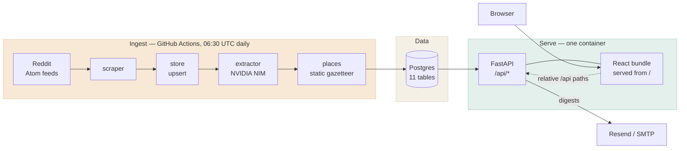
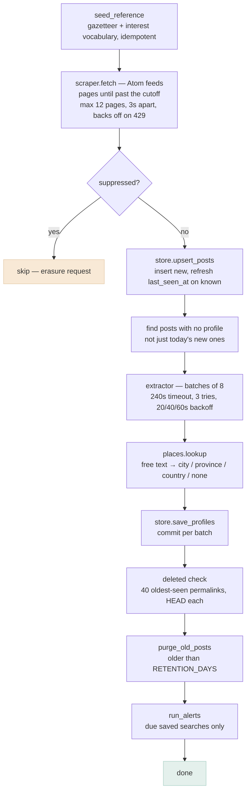
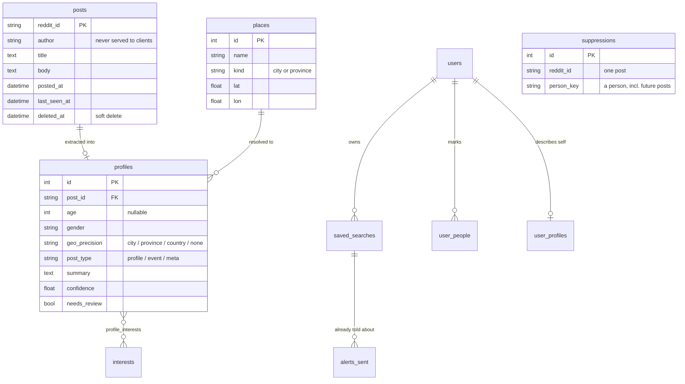
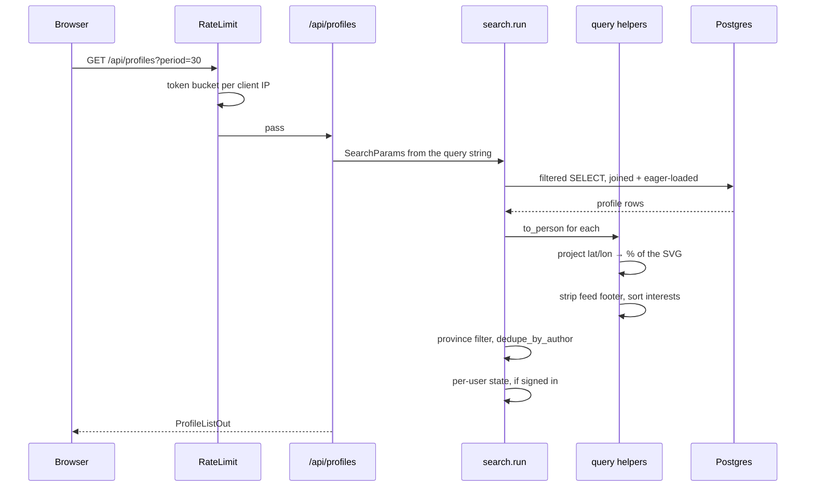
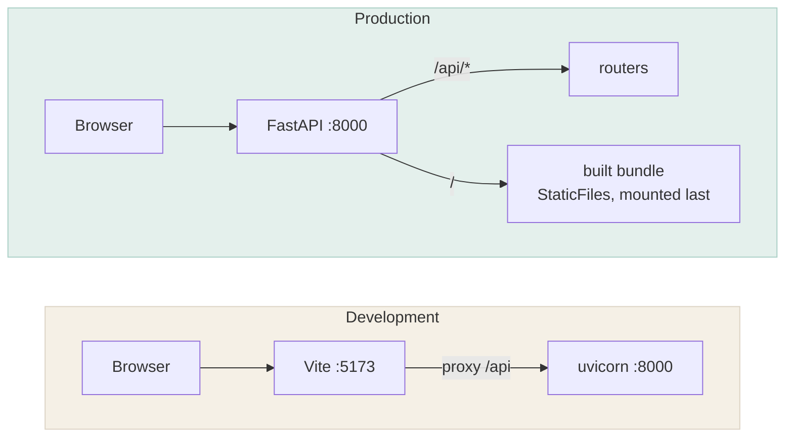

# Architecture

FriendMap NL turns a reverse-chronological subreddit feed into a filterable map.
That single sentence explains most of the structure: **scraping is a batch job,
serving is a web app, and the database is the only thing they share.**

Everything below is either in the code or checkable against it. Where a number
appears, it's the number the code actually uses.

---

## 1. The shape



Three planes, deliberately decoupled:

| Plane | Runs | Talks to |
| --- | --- | --- |
| **Ingest** | a scheduled container, minutes a day | Reddit, the LLM, the database |
| **Serve** | a long-lived container | the database only |
| **Data** | Postgres | nothing; it is the interface |

The serving plane **never** calls Reddit or the LLM. A page load touches only
Postgres, which is why the API stays fast while extraction is slow and
rate-limited. It also means the site keeps working when the ingest is broken —
it just stops getting fresher.

### Why one container serves both the API and the bundle

The web app calls the API on relative `/api` paths and the session cookie is
`SameSite=Lax`. Hosting the bundle separately would mean CORS *and* a cross-site
cookie. Instead the image builds the React app and FastAPI serves `dist/`, so
production has the same single-origin shape as development, where Vite's proxy
already provided it. That decision is why the auth code is as small as it is.

### Why ingest runs on GitHub Actions

Render's cron jobs are a paid feature. The scheduled workflow runs **the same
image** with a different command (`ingest --days 7` instead of `serve`), against
the same database over its external URL. Nothing about the job is specific to
Actions; on a paid plan it moves to a Render cron job unchanged.

---

## 2. The daily ingest



Four ordering decisions in there are load-bearing:

1. **Extraction reads "posts with no profile", not "posts inserted today."** A
   batch that failed yesterday — timeout, rate limit — would otherwise leave
   those posts invisible forever. Instead the next run heals it. This is also why
   `--days 7` matters even though the job is daily: the repair window is the
   scrape window, so a one-day window would make a failed batch permanent. It
   costs nothing, because one feed page already reaches ~12 days back, so a 1-day
   and a 7-day window fetch the same single page.
2. **Suppression is checked at the write path, not the read path.** The post is
   still live on Reddit, so deleting a row only removes it until tomorrow's
   scrape. Filtering at `upsert_posts` is what makes an erasure request stick.
3. **Retention runs before alerts**, so a digest can't announce somebody the same
   run is about to delete.
4. **Alerts run last**, so they only ever consider people already stored.

### Extraction is batched, not concurrent

NIM's free tier limits **requests per minute**, not concurrency. So N posts go out
as `ceil(N/8)` calls, not N. Each item comes back as one JSON object keyed by its
index, which survives the model dropping or reordering an entry far better than a
bare array does — and `_parse` tolerates prose and code fences around it, because
models add them regardless of instructions.

`_coerce` is the boundary between a model that will occasionally say anything and
a database with fixed vocabularies. It range-checks age (13–99, so a birth year
becomes `None`), maps gender into a closed set, drops interest tags outside the
23-word vocabulary, clamps confidence, and turns the string `"null"` into a real
`None`.

---

## 3. Data model



`suppressions` stands apart deliberately: it references nothing, because it has
to outlive the rows it removes.

### The two structural choices

**`posts` and `profiles` are separate tables.** Raw scrape on one side,
LLM-derived interpretation on the other. Extraction can be re-run with a better
prompt without re-scraping, and a bad extraction can never destroy the source
text. `reextract` and `regeocode` exist because of this split.

**There is no `people` table.** People are grouped **by author at query time**, so
the grouping can't drift out of sync with the posts it summarises. The cost is
that `Person.id` is a *post* id, which changes the moment someone posts again —
so anything a user attaches to a person can't key on it.

That's what `person_key` is for: `HMAC(PERSON_KEY_SECRET, lowercased author)`,
truncated to 24 hex chars. Stable across reposts, and **not reversible** —
`sha256(username)` would be trivially reversible with a wordlist, since Reddit
usernames are a small enumerable space. The username itself is excluded from
every API response.

---

## 4. The read path



**`search.run()` is the single implementation of "which people match these
filters"**, shared by the API route and the nightly alert job. Two
implementations would drift, and a saved search that quietly stops meaning what
it said when it was saved is worse than no saved search at all.

A few things happen in Python rather than SQL, on purpose:

- **Dedupe by author.** The result set is hundreds of rows, not millions, and a
  window function would make the filter composition much harder to follow. It
  sorts on the full timestamp, not `days_ago` — whole days tie for everyone who
  posted today, which used to pick an arbitrary post per person.
- **Province filtering**, because it needs the resolved place, so it lands after
  mapping.
- **Per-user state after dedupe**, because it keys on `person_key`, which is only
  meaningful once one post per person has been chosen.

### Geography

`ingest/projection.py` reproduces the design's hand-drawn Netherlands as a plain
Web Mercator projection into a **460×552** viewBox — fitted to the designer's own
pixel coordinates for 21 cities, to within 0.05px. The API therefore hands the
frontend ready-to-use percentages, and the browser never needs to know what a
projection is.

Location resolution is a **static gazetteer** (~141 places), not a geocoding API:
no key, no rate limit, no network in the hot path, and identical results every
run. Anything it can't place stays `none` rather than being guessed at.

### Clustering is a frontend concern

The gazetteer gives every person in a city the *identical* coordinate, so 90
Amsterdammers are 90 divs on one pixel. `web/src/cluster.ts` merges points within
**26px on screen** — and because that's screen space, zooming pulls clusters
apart again, which is the whole interaction.

People who never named a place are moved to a marked anchor **out in the North
Sea** rather than left on their fallback Amsterdam coordinate, where they
outnumbered the real Amsterdammers 158 to 55 and made the map's biggest marker a
place that isn't one.

---

## 5. How the frontend and backend talk

REST and JSON over **relative** paths. No GraphQL, no WebSockets, no
server-side rendering. The notable property is that the browser is **always on
one origin**, arrived at two different ways:



Because of that, no base URL appears anywhere in the frontend — it calls
`fetch("/api/profiles?…")` and that is the whole client configuration. CORS
never enters the hot path; the `CORSMiddleware` in `main.py` is a development
affordance and nothing more.

### Auth is a cookie, not a token

Every call passes `credentials: "same-origin"`. The session is a signed,
`HttpOnly`, `SameSite=Lax` cookie, `Secure` whenever `WEB_ORIGIN` is https —
so there is no token in JavaScript for an XSS to read, and no `Authorization`
header to plumb through.

Sign-in is the one exception: **a full-page redirect, not a fetch**, because an
OAuth round trip cannot happen inside `fetch`. `startGoogleLogin()` sets
`window.location` and passes the current view as `next`, so the user lands back
where they were. `SameSite=Lax` is precisely what lets the cookie survive
Google's top-level redirect back.

### The client cache carries most of the design

TanStack Query, configured once in `main.tsx`: `staleTime` 60s,
`refetchOnWindowFocus: false`, `retry: 1`.

- **The query key *is* the query string.**
  `queryKey: ["profiles", filtersToParams(debouncedFilters).toString()]` — so a
  filter change is a new key and refetches automatically, and any combination
  already seen comes back from cache with no request.
- **`filtersToParams` has two consumers**: it builds the request *and* is
  mirrored into the address bar with `history.replaceState`. One function, so a
  shared URL reproduces exactly the API call it came from. The address bar, not
  React state, is the source of truth for filters.
- **Debounced and cancellable.** Filters are debounced 250ms before reaching the
  query key, so dragging the age slider doesn't fire a request per pixel, and
  React Query's `AbortSignal` is threaded into `fetch` so superseded requests
  are actually cancelled. `placeholderData: (prev) => prev` keeps the previous
  list on screen while refetching instead of flashing empty.
- **Queries that cannot work are never sent.** `/api/auth/me` is gated on
  `enabled: authConfigQuery.data?.enabled === true`, and the signed-in
  endpoints on `enabled: !!meQuery.data`. With auth switched off the app makes
  no doomed requests.
- **Writes are optimistic.** Bookmarking updates the cache before the server
  answers — "a bookmark that lags behind the click feels broken" — snapshots the
  previous value, rolls back on error, and on settle invalidates *both*
  `my-people` and `profiles`, because hiding someone changes who the map should
  show.

Errors: the `get` helper throws on a non-2xx; the `send` helper additionally
unwraps FastAPI's `{"detail": …}`, so a 409 arrives as *"You already have 5
saved searches"* rather than "409 Conflict".

### The seam, and how it is held shut

`web/src/types.ts` mirrors the Pydantic response models **by hand**. That reads
well, but on its own nothing checks the two declarations agree: rename a field
in `schemas.py` and TypeScript keeps compiling against the old name. It was the
one place a change could pass both CI jobs and still break the app at runtime.

Three pieces close it:

| File | Generated from | Purpose |
| --- | --- | --- |
| `web/src/api-schema.json` | `backend/scripts/dump_openapi.py` | the server's own OpenAPI document, committed |
| `web/src/api-types.ts` | `npm run api:types` | types generated from that schema |
| `web/src/api-contract.ts` | hand-written | asserts `types.ts` and the generated types declare the same fields |

The assertions compare **field names, not value types**, deliberately. The
client narrows some fields the schema leaves wide — `gender` is `string` in
OpenAPI but a union in `types.ts`, because the server constrains it to a closed
vocabulary that OpenAPI does not express. Demanding full structural equality
would flag those narrowings as errors and the file would end up disabled.
Names catch the drift that actually breaks things.

A rename now fails the typecheck with the offending field named in the error:

```
src/api-contract.ts(51,7): error TS2322: Type 'boolean' is not assignable
  to type '{ missingFromSecond: "summaryText"; }'.
```

CI checks each half in the job that has the toolchain for it: the `api` job
regenerates the schema and fails if it differs from the committed copy; the
`web` job regenerates the types and fails if *they* differ. Together they mean
the contract file is asserting against something current rather than a snapshot
that quietly stopped being true.

Both generated files are type-only, so they add nothing to the bundle.

The first thing this check found, on the run that introduced it, was a
`new_matches` field on `SavedSearchOut` that nothing ever assigned and the
frontend never read — the API advertising a count that was always zero.

## 6. Ranking is a sort, never a filter

`app/ranking.py` scores overlap between two lists of self-declared facts:
interests ×3.0, place ×2.0, age ×1.0, recency ×0.5. Nobody is ever removed for
scoring low, and the numbers that order the list are the same ones that produce
the "3 shared interests · same city" line on the card — so the ranking can't say
one thing and show another.

The subtle constant is `UNKNOWN = 0.25`, what a missing value scores. It has to
sit **above** a hard mismatch (0.0) and **below** the weakest genuine signal —
one shared interest scores ⅓, same-province ½. At its original 0.5 it beat both,
and the top of every list filled with people the app knew nothing about: a silent
quality failure, since the feature still "worked". There's a test named after each
half of that invariant.

---

## 7. Failure modes

The interesting part of this system is what happens when something is broken, and
most of it has been observed rather than imagined.

| Failure | Effect | Handling |
| --- | --- | --- |
| Reddit 429 | scrape stalls | 4 attempts, backing off 20s → 80s; 3s between pages regardless |
| NIM timeout or 503 | a batch yields nothing | 3 tries with backoff; unextracted posts retried by the *next run*, because extraction selects on "no profile yet" |
| Reddit feed shape changes | posts stop parsing | **not covered** — the scraper's HTTP layer has no tests. The likeliest failure, and invisible until a run returns nothing |
| Post deleted on Reddit | must leave the map | 40 oldest-seen permalinks checked per run; `deleted_at` set, filtered from every read. Soft delete, so a transient 404 is recoverable |
| Database unreachable | API errors | `/healthz` deliberately **doesn't** touch Postgres — tying liveness to the DB turns a brief blip into a restart loop |
| Ingest never runs | data goes stale, nothing breaks | 7-day window absorbs up to a week of missed runs |
| Mail transport fails | digest lost | `alerts_sent` is written **only** after a successful send, so tomorrow retries instead of silently swallowing the match |
| Scraper re-adds erased post | erasure undone | `suppressions`, checked at `upsert_posts` |

---

## 8. Module map

```
backend/
  app/                      the serving plane — reads only
    main.py                 app assembly; middleware order matters
    config.py               all env reading, in one place
    models.py               11 tables + the closed vocabularies
    db.py                   engine + session factory
    query.py                base_query, to_person, dedupe_by_author
    search.py               the one filter implementation
    ranking.py              overlap scoring, explainable
    identity.py             person_key HMAC
    alerts.py               digests + signed unsubscribe tokens
    mail.py                 console | smtp | resend
    auth.py                 Google OAuth, signed session cookie
    ratelimit.py            in-process token bucket
    privacy.py              the Art. 13/14 notice
    routers/                profiles, stats, me
  ingest/                   the batch plane — writes
    scraper.py              Atom feeds, paging, liveness checks
    extractor.py            LLM boundary: prompt, _parse, _coerce
    places.py               static gazetteer + fuzzy lookup
    projection.py           lat/lon → the design's pixel space
    store.py                every write, incl. suppress and purge
    pipeline.py             orchestration; the order above
    textclean.py            strips the feed footer
web/src/
  App.tsx                   state lives in the URL query string
  cluster.ts                screen-space clustering, spiderfy
  format.ts                 headline, relative time, location text
  postDraft.ts              the composer — the extractor inverted
  api.ts                    typed fetch layer
```

`web/src/postDraft.ts` is worth calling out: the app spends all day failing to
find age, location and interests in people's posts, so it knows exactly which
facts a good post states plainly. The composer is that knowledge turned around,
and its checklist quotes measured gaps from the live corpus rather than generic
advice.

---

## 9. Deliberately absent

Each of these is a decision, not an omission:

- **No messaging.** The app cannot contact anyone. Every card links back to
  Reddit, where the conversation happens under Reddit's own rules and blocking.
  This is also the single strongest point in the [legitimate interest
  assessment](legitimate-interest-assessment.md).
- **No passwords.** Identity comes from Google; the only durable identifier is
  the opaque `sub`.
- **No `people` table** — see §3.
- **No Alembic.** Schema comes from `create_all`, which is fine while it's still
  moving and needed before there's data worth migrating.
- **No special-category inference.** The interest vocabulary omits health,
  sexuality, religion and ethnicity even though the posts mention them.
- **No search-engine visibility.** `noindex` as both a header and a meta tag.
- **No third-party requests.** Fonts self-hosted, no analytics — so there's
  nothing to ask consent for.
- **More than one web worker.** The rate limiter's buckets are in-process, so N
  workers would mean N× the intended ceiling. `WEB_CONCURRENCY=1` is a
  correctness constraint, not tuning.

---

## 10. Testing shape

The backend suite runs on **SQLite**, not Postgres: `tests/conftest.py` points the
engine at a temporary file before `app.db` is imported. The schema uses no
Postgres-specific types, so this is honest — and it's why the suite finishes in
seconds instead of waiting on a container.

The one thing SQLite can't cover is the dialect itself, so CI keeps a separate
smoke job that boots against a real Postgres 16 using the bare `postgresql://`
URL a managed host hands out — the exact form that would break the psycopg driver
rewrite.

Tests are aimed at boundaries rather than coverage: the LLM output contract, the
gazetteer, the invariants with a comment explaining why they exist, and the things
that are privacy decisions. See the README's *Tests* section.